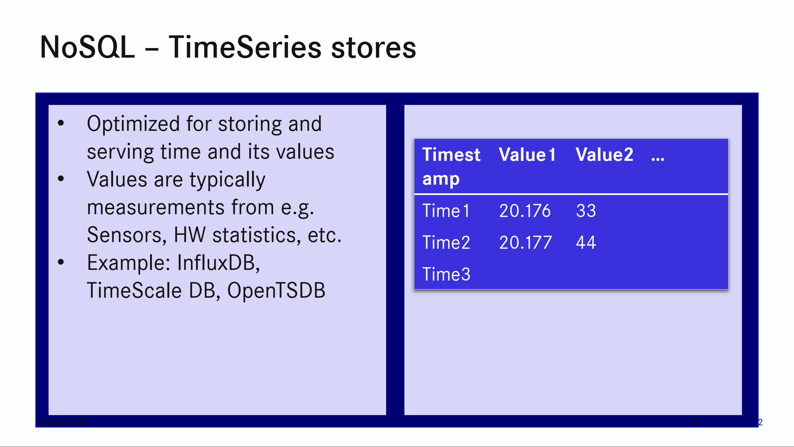
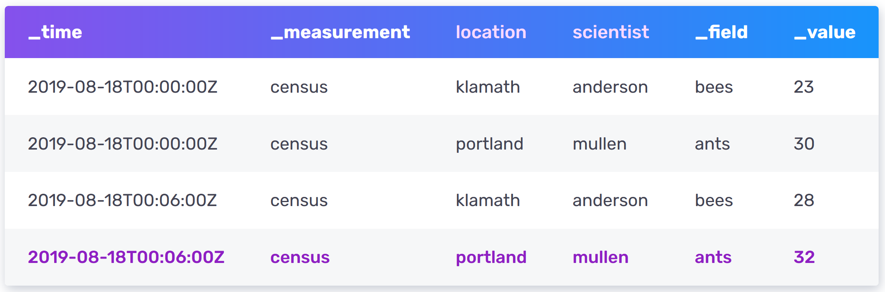

As stated in the introduction, *InfluxDB* is a schemaless time series database. But what does that mean exactly? What’s the data model behind InfluxDB? Let’s take some time to define the key concepts needed for this scenario.

## Time Series

*Time series* are collections of sequential datapoints with timestamps indicating the time of recording said datapoint. They can be of *regular* or *irregular* nature. Regular time series occur if measurements are taken in set intervals. In the case of irregular time series, data recording is triggered by external events. [TSA]

Since relational databases usually don’t perform well with large time series, time series databases were developed. They usually are *schemaless*, meaning that they don’t need data to fit in pre-defined structures and that the structure of data can change from datapoint to datapoint. [ZEH]

Have a look at the following slide for a short summary and some example time series data:

[BUC]

## Data Modeling and Design

InfluxDB stores data in so-called buckets. They are collections of datapoints with a set retention period. Each datapoint has at least a timestamp, a measurement, and a field. Tags may be used to store metadata. Let’s define these terms:

- **Timestamp**: Time of recording for a given datapoint.
- **Measurement**: String used to group datapoints that belong together.
- **Fields**: Pair of key and value. The Key is a string describing what’s being measured and the value is the value of the measurement at the given timestamp.
- **Tags**: Pair of key and value. Additional metadata for the measurements. The keys are strings and can be interpreted as columns, while the tag value contains the actual metadata.

In this example scientist at multiple locations count populations of bees and ant at different times. The *measurement* is called ‘census’ and is used for counting both types of insects. ‘location’ and ‘scientist’ are *tags*, offering more information about the datapoints. And finally, the *field key* ‘_field’ shows which insect is counted and the *field value* ‘_value’ is the population at any given time.

[IN1]